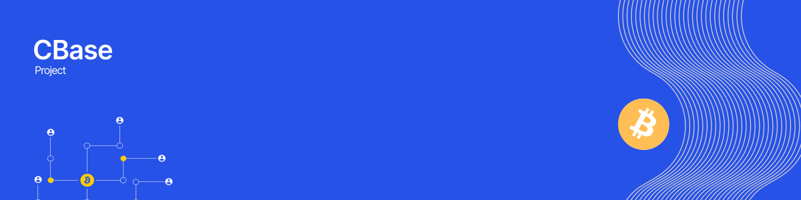

This project is an implementation of the Coinbase Mobile App Design System built with **Flutter**, following industry best practices such as **Atomic Design**, **Design Tokens**, and **Component-Based architecture**.

---

### 1. Install

This is a sample project. You can clone the repository and add the `coinbase_ds` folder to your main Flutter project as a **local package**.

**a) Add to `pubspec.yaml` in your project:**

```yaml
dependencies:
  coinbase_ds:
    path: path/to/coinbase_ds
```

**b) run the command:**

```bash
flutter pub get
```
---

### 2. Theme configuration and usage examples

To apply the Design System globally, wrap your `MaterialApp` with the provided theme:

```dart
import 'package:coinbase_ds/coinbase_ds.dart';

void main() {
  runApp(const MyApp());
}

class MyApp extends StatelessWidget {
  const MyApp({super.key});

  @override
  Widget build(BuildContext context) {
    return MaterialApp(
      title: 'Coinbase Clone App',
      theme: AppTheme.light, //Aplly themme
      home: const DsShowcasePage(), // Examples
    );
  }
}
```

---

### 3. How to Improve 

* Add more components from the original Design System

* Implement Dark Mode

* Improve documentation and examples

---
### Ref:

[Coin Base Mobile App Clone & Design System - Figma File](https://www.figma.com/community/file/1165352571580063620)